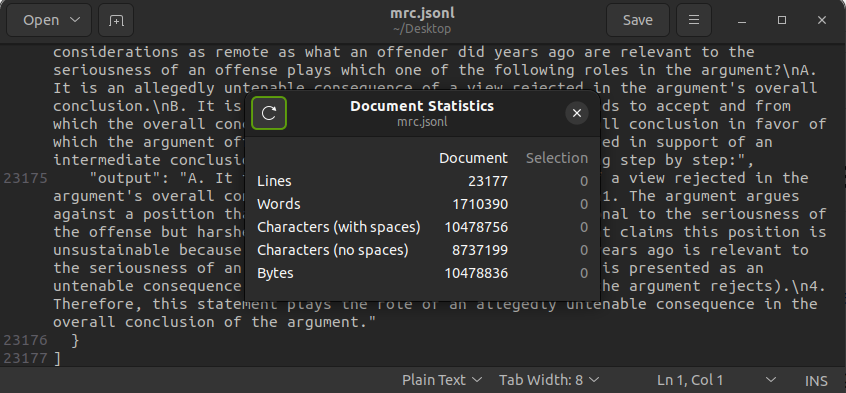

# Instruction following data
> For non-commercial research purpose only.

**Important**: To request the full dataset, please 
1. Submit an access request to our huggingface page [csitfun/LogiCoT](https://huggingface.co/datasets/csitfun/LogiCoT) through your huggingface account.
2. Send an email to Hanmeng Liu at hanhaishiyi@gmail.com. Please tell us your huggingface account username, your real name, org, and purpose. You need to guarantee that you will not share the data with others. We will approve your request after your info is provided.

`mrc.jsonl`: English instruction tuning data for the logical reading comprehension task

`mrc_zh.jsonl`: Chinese instruction tuning data for the logical reading comprehension task

`general_inference.jsonl`: English instruction tuning data for the general inference task

* Remember, this version of the data does not filter out GPT-4 responses that give the wrong answer. If there is a need, fell free to change it. Share it back to us if you'd like your version been distributed. but remember, the only way to distribute it is through Hanmeng Liu. Please do not distribute without permission.
